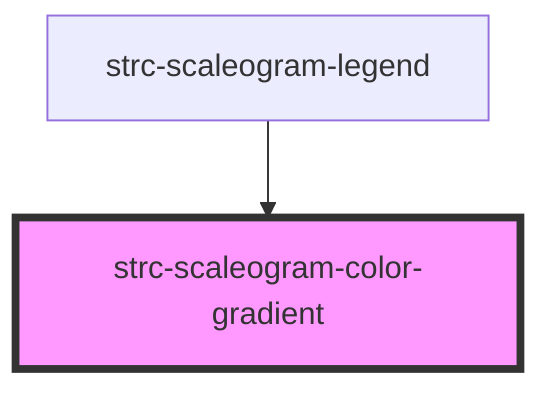

# strc-scaleogram-color-gradient

<!-- Auto Generated Below -->

## Properties

| Property     | Attribute | Description                       | Type                        | Default     |
| ------------ | --------- | --------------------------------- | --------------------------- | ----------- |
| `colorScale` | --        | Color scale.                      | `(value: number) => string` | `undefined` |
| `range`      | --        | Data range of the color gradient. | `[number, number]`          | `undefined` |

## Dependencies

### Used by

 - [strc-scaleogram-legend](../legend)

### Graph

----------------------------------------------

*Built with [StencilJS](https://stenciljs.com/)*
