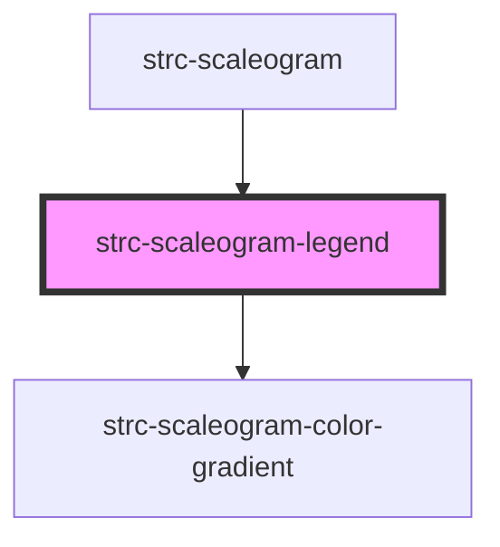

# strc-scaleogram-legend

<!-- Auto Generated Below -->

## Properties

| Property     | Attribute | Description                | Type                        | Default     |
| ------------ | --------- | -------------------------- | --------------------------- | ----------- |
| `colorScale` | --        | Color scale of the legend. | `(value: number) => string` | `undefined` |
| `range`      | --        | Range of the legend.       | `[number, number]`          | `undefined` |

## Dependencies

### Used by

 - [strc-scaleogram](../scaleogram)

### Depends on

- [strc-scaleogram-color-gradient](../color-gradient)

### Graph

----------------------------------------------

*Built with [StencilJS](https://stenciljs.com/)*
