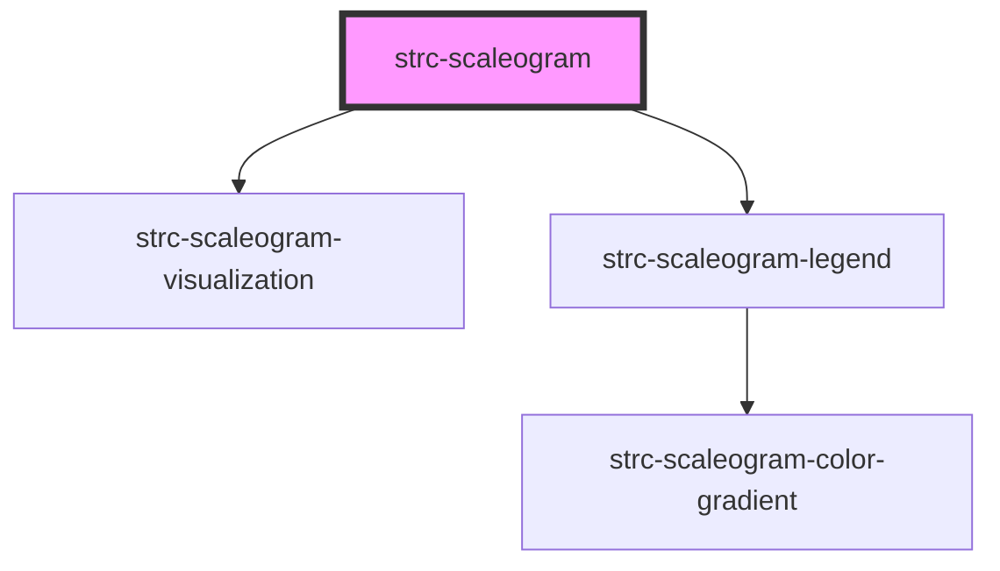

# strc-scaleogram

<!-- Auto Generated Below -->

## Properties

| Property      | Attribute      | Description                                          | Type     | Default     |
| ------------- | -------------- | ---------------------------------------------------- | -------- | ----------- |
| `data`        | `data`         | Data as string of a JSON array of arrays of numbers. | `string` | `undefined` |
| `invertScale` | `invert-scale` | Boolean if scale should be inverted as a string.     | `string` | `'false'`   |
| `scale`       | `scale`        | Color scale as string in Chroma.js format.           | `string` | `'RdBu'`    |

## Dependencies

### Depends on

- [strc-scaleogram-visualization](../visualization)
- [strc-scaleogram-legend](../legend)

### Graph

----------------------------------------------

*Built with [StencilJS](https://stenciljs.com/)*
