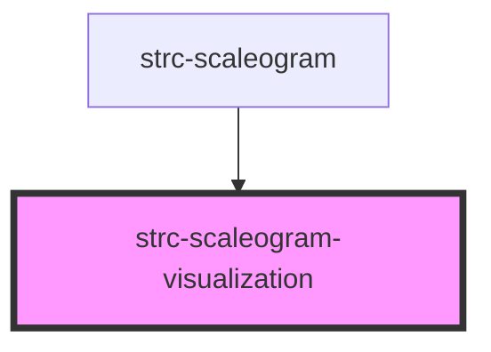

# strc-scaleogram-visualization

<!-- Auto Generated Below -->

## Properties

| Property     | Attribute | Description                           | Type                        | Default     |
| ------------ | --------- | ------------------------------------- | --------------------------- | ----------- |
| `colorScale` | --        | Color scale.                          | `(value: number) => string` | `undefined` |
| `data`       | --        | Data of the scaleogram visualization. | `number[][]`                | `undefined` |

## Dependencies

### Used by

 - [strc-scaleogram](../scaleogram)

### Graph

----------------------------------------------

*Built with [StencilJS](https://stenciljs.com/)*
